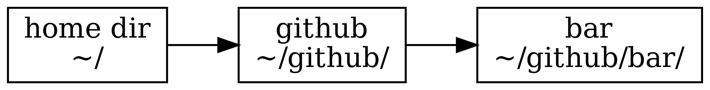
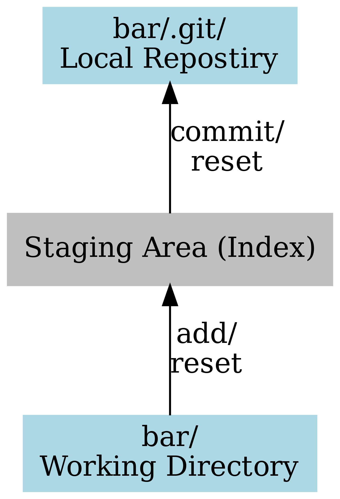

# はじめに

Windows で github で共同作業に参加するための
手順表です。
このレッスンの前に
[ダウンロード](download.md)、
[Github に登録する](github.md)
のレッスンを必ず読んでください。
そのレッスンでの手順通りにしていれば、
すでにあなた (`foo`) の `github.com` サイト
(https://github.com/foo/)
に、リポジトリ (`bar`) 
(https://github.com/foo/bar) がある筈です。
（以下 `foo` の部分は、
あなたの実際のアカウントネームに読み換えてください）。

# Git 管理のディレクトリをつくる

これからの作業はすべてローカルの terminal 上でおこないます。
Windows terminal を立ち上げてください。
そして、以下のコマンドを打ちます。

```bash
cd
mkdir github
```

`cd` は "change directory" 
[^dir] の意です。
何も引数をつけないと home directory に移動する筈です。
たぶん、ウィンドウズでは `C:\` になるのだと思います。
`mkdir` は "make directory" の意です。
以上で、ホームディレクトリの下に
`github` というディレクトリができました。
これで、つぎのようなディレクトリ構造ができている筈です。

{width=40%}

[^dir]: directory は、ウィンドウズになってから
何故か「フォルダ」という名前になってしまいました。

かくして作った `~/github/` の下に、
さきほとの bar リポジトリをクローン
（ダウンロードみたいなもの）します。
（`foo` の部分は、
各自のアカウントネームに替えてください）


```bash
cd ~/github/
git clone git@github.com/foo/bar
```

1行目のコマンド (`cd`) で、
現在ディレクトリが
`~/github/` にかわります。
2行目が `git` の[クローン](git-clone.md) のコマンドです。
さきほど github でつくった bar がクローン
されます。
ディレクトリ構造は以下のようになります。

{width=60%}

あたらしく出来た `bar` ディレクトリを
「作業ディレクトリ」 
[working_directoryh](working_directory.md) と呼びます。


# ディレクトリの中身

それでは（`bar` リポジトリを）クローンした
`bar` ディレクトリの中身を見てましょう。
ディレクトリの中身（ファイルたち）を見るには
`ls` （"list" の意です）コマンドをつかいます。

```bash
cd ~/github/bar/
ls -la
```

bar リポジトリの `README.md` と `.gitignore` が
そのまま作業ディレクトリにダウンロードされていることが
わかるでしょう。
その他に `.git/` という名前のディレクトリがある筈です。
この部分を[ローカルリポジトリ](local_repository.md) 
[^loc] と呼びます。

[^loc]: 「ローカルリポジトリ」は「作業ディレクトリ」と同じという
  説明もあるのですが、ここではその説明はとりません。
  
# ローカルリポジトリ

この節では、
GitHub があることは忘れて、ローカルのマシンだけの
話題に限定します。

## 構造

三つの抽象的ステージがあるとかんがえてください。
じっさいの作業は作業ディレクトリの中のファイルの編集や
削除などです。
適当な段階 [^tekito] で変更作業を
[ステージングエリア](staging_area.md) 
（あるいは「インデックス」）に登録
([git add](git-add.md))します。
この段階では登録をやめること
([git reset](git-reset.md)) は簡単にできます。

変更に自信をもてる段階になったら、
ステージングエリアからローカルリポジトリに
[コミット](git-commit.md) します

[^tekito]: どのくらいが「適当な段階」かということについては、
 別の場所で述べます。

{width=30%}

## じっさいの作業

じっさいに作業をしてみましょう。

README.md を編集しましょう。
[エディタ](editor.md) には atom をつかっていることとします。

```
atom README.md
```

`README.md` の中身は `bar` と書かれているだけです。
これを削除して、
以下のように書き直します。

```
---
title: bar の README
author: foo
---

はじめての github です。

```

ここで

```
git status
git add README.md
git status
```

さいしょの [git status](git-status.md) では、
"Changed not staged to commit" のもと、[^stage]
README.md が挙げられている筈です。
具体的には git からのメッセージに
以下の行がある筈です。

```
modified:  REAMD.md
```
[^stage]: ステージングエリアに 「add する」とも、
  「stage する」とも言われます。

二行目で、
この README.md をステージングエリアに
add/stage します。


