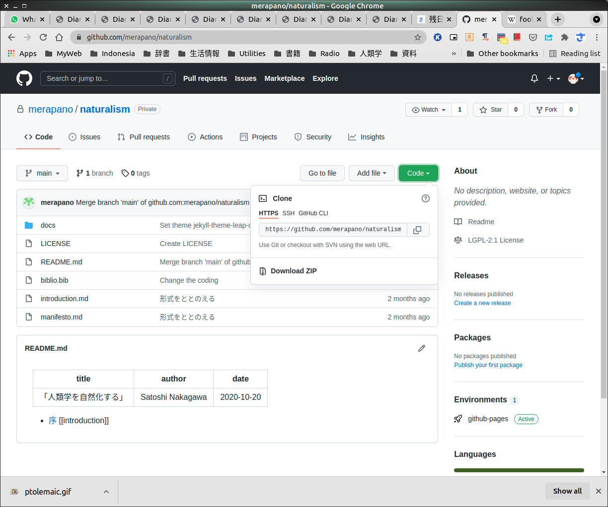

# 序

だれか（「オーナー」と呼ぼう、foo）がリポジトリをつくってくれて、
いまあなた (bar) をコラボレーターとして招待したいという状況
（See [オーナー編](github-owner.md)）
です。

ここでは全くの素人がはじめて github を使うことを
想定しています。

# アカウントをとる

オーナーがあなたを
コラボレーターとして招待するためには、
あなたが Github にアカウントをもっていなければなりません。

[GitHubアカウント作成とリポジトリの作成手順](https://qiita.com/kooohei/items/361da3c9dbb6e0c7946b) を参考に
アカウントを獲得してください。
[^401]

[^401]: この状態（コラボレーターとなっていない状況）で、当該のリポジトリ、
`https://github.com/foo/baz/`
にアクセスしても、
「これはリポジトリではありません」という
ページに着くだけです。

このニュースをオーナーに知らせると、
オーナーから
「あなたをコラボレーターにした」というメールが
届きます。
メールの中の `View Invitation` をクリックして次のページに行き、
`Accept invitation` をクリックします。

# 当該のリポジトリに行く

オーナーは foo さん、リポジトリは baz なので、
`https:github.com/foo/baz` がじっさいの URL となる。
このリポジトリにアクセスする。

{width=70%}

コラボレーターなので、
やろうと思えば
この画面で作業ができる。
しかしそれでは github のよさをまったく
発揮できない。
このリポジトリをローカルにコピー（「クローン」と言う）して、
ローカルで作業する必要がある。

# ssh 鍵を登録する

おしえてもらったページに行き、
ssh キーを登録します。

