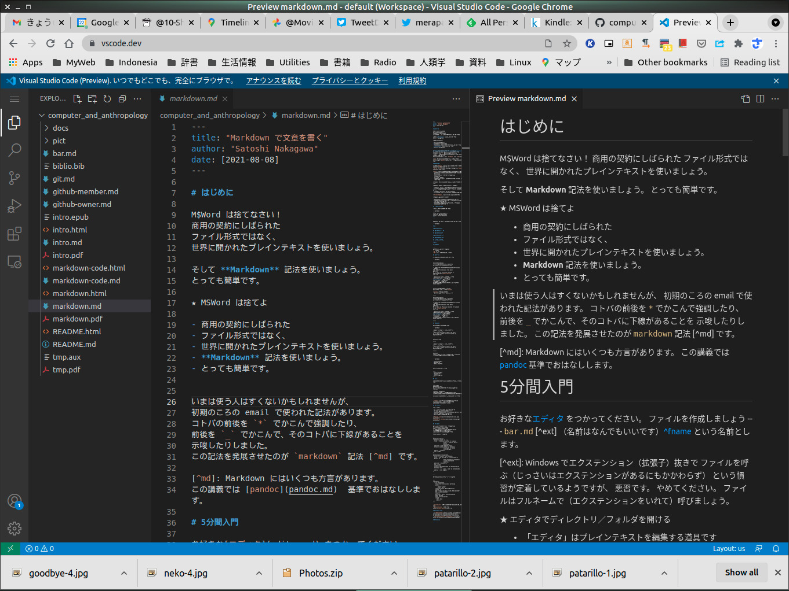

# はじめに

M$Word は捨てなさい！
商用の契約にしばられた
ファイル形式ではなく、
世界に開かれたプレインテキストを使いましょう。

そして **Markdown** 記法を使いましょう。
とっても簡単です。

★ MSWord は捨てよ

- 商用の契約にしばられた
- ファイル形式ではなく、
- 世界に開かれたプレインテキストを使いましょう。
- **Markdown** 記法を使いましょう。
- とっても簡単です。


いまは使う人はすくないかもしれませんが、
初期のころの email で使われた記法があります。
コトバの前後を `*` でかこんで強調したり、
前後を `_` でかこんで、そのコトバに下線があることを
示唆したりしました。
この記法を発展させたのが `markdown` 記法 [^md] です。

[^md]: Markdown にはいくつも方言があります。
この講義では [pandoc](pandoc.md)  基準でおはなしします。

# 5分間入門

お好きな[エディタ](editor.md) をつかってください。
ファイルを作成しましょう ---
`bar.md` [^ext] （名前はなんでもいいです）[^fname]
という名前とします。

[^ext]: Windows でエクステンション（拡張子）抜きで
  ファイルを呼ぶ（じっさいはエクステンションがあるにもかかわらず）
  という慣習が定着しているようですが、
  悪習です。
  やめてください。
  ファイルはフルネームで（エクステンションをいれて）呼びましょう。

[^fname]: 日本語のファイル名は使わないようにしましょう。

★ エディタでディレクトリ／フォルダを開ける

- 「エディタ」はプレインテキストを編集する道具です
- 「メモ帳」でいいのですが、きょうは「VS Code」を使いましょう
- 「エディタ」がなにだかわからない人は 
- ブラウザで https://vscode.dev/ にアクセスしましょう

{width=70%}

★ エディタでファイルをつくる

- 紙に＋（プラスサイン）のアイコンを押します
- ファイル名の入力がうながされますので、適当な名前
  (bar.md) を入力します
- 右の大きな画面で、入力がうながされますので、
  ここに書いていきましょう

## タイトルと構成

まずはタイトルを書きましょう。

```markdown
---
title: 人類学を自然化する
subtitle: ミリカンの誤解
author: Satoshi Nakagawa
---

```

つぎに、だいたいの枠組をつくってしまいましょう。

```markdown

# 序

# ミリカンの哲学

## ミリカンはだれか

## ミリカンの哲学

# ミリカンと人類学

## ANTという人類学

## どうしたこうした

# 結論

# 参考文献


```
できあがったバージョンでは、
`#` は章、
`##` は節、
`###` は小節として表示されます。

## 文字飾り

それではさっそく書いていきましょう。

```markdown


この論文の目的は、
ルース・ミリカンの自然主義的哲学を
人類学に応用する仕方を議論する。

わたしが「人類学」ということばで意味するのは、
たとえば
E.E. Evans-Pritchard の *The Nuer*
であり、
E. R. Leach の *Political Systems of 
Highland Burma* [@leach-kachin]
なのだ。

一つの段落の中の改行は無視されます。
そして、文字の装飾も簡単です。
***ボールド*** もできますし、
*イタリック* も簡単です。
~打ちけし線~ もできます
下付き、上つきも以下のようにすればＯＫです。
H~2~O とか 4^2^

```

以上のようにして書いたものが、
次のように出力されます。[^md]

[^md]: MSWord と違い、
  さまざまなプログラムが使われます

-----

この論文の目的は、
ルース・ミリカンの自然主義的哲学を
人類学に応用する仕方を議論する。

わたしが「人類学」ということばで意味するのは、
たとえば
E.E. Evans-Pritchard の *The Nuer*
であり、
E. R. Leach の *Political Systems of Highland Burma* [@leach-kachin]
なのだ。

一つの段落の中の改行は無視されます。
そして、文字の装飾も簡単です。
***ボールド*** もできますし、
*イタリック* も簡単です。
~~打ちけし線~~ もできます
下付き、上つきも以下のようにすればＯＫです。
H~2~O とか 4^2^

-----

## 列挙、表

表は、つぎのように書きます。

```markdown

| 左詰め | 右詰め | センタリング |
|:-     |-:| :-:|
| E.E.Evans-Pritchard| 1935 | The Nuer|
|E.R. Leach | 1954| Political Systems of Highland Burma|

```

こうなります。

-----

| 左詰め | 右詰め | センタリング |
|:-     |-:| :-:|
| E.E.Evans-Pritchard| 1935 | The Nuer|
|E.R. Leach | 1954| Political Systems of Highland Burma|

------

列挙は、
論文の中ではめったに使わないかもしれませんが、
メモをとるときなどには便利でしょう。


```markdown

- こんな風にして
- 列挙します
- かんたんですね

```

次のように表示されます。


----
- こんな風にして
- 列挙します
- かんたんですね
----

## 脚注

論文を書くのに大事な脚注はつぎのように入れることができます。

```
その問いは
書くことに対する
確たる基盤をなくしてしまう問いなのである。
[^kitan]

[^kiban]: ここでは、
「ある議論が無限退行を引き起こすならば、
その議論は間違っている」という判断を採用している。

脚注がおわり、ここからまた本文がはじまります。

```

`[^foot]:` の部分が脚注の内容となりますが、
脚注のおわりは空行によって示します。
番号はつける必要はありません。

## プレビュー

★ プレビュー

- プレビュー機能があれば利用しましょう
- VS Code では右側の上にあります
- いくつかのアイコンにマウスをかさねてみてください
- Preview と表示されると思います
- さっそくクリックしてみましょう

{width=70%}


## 引用文献

データベースをつくるのが一苦労ですが、
それさえつくってしまえば、
何度も使うことができます。
わたしは bibtex 形式を採用していますが、
もっと読み易い形式があるので、
そちらを採用するのがいいでしょう。

以下は bibtex 形式です。 


```
@book{leach-kachin,
	author = {Leach, E. R.},
	title = {Political Systems of Highland
                  Burma: A Study of Kachin Social
                  Structure},
	publisher = {The Athlone Press},
	series = {London School of Economics
                  Monographs on Social
                  Anthropology},
	address = {London},
	year = 1954
}

@book{andaya-arung-palakka,
	author = {Leonard Yuzon Andaya},
	title = {The Heritage of Arung Palakka: A History of
                  South {Sulawesi} ({Celebes}) in the Seventeenth
                  Century},
	publisher = {Nijhoff},
	year = 1981,
	volume = 91,
	series = {Verhandelingen van het Koninklijk Instituut voor
                  Taal-, Land- en Volkenkunde},
	address = {The Hague},
}


```

あるいは、以下のような形式もＯＫです。

```
---
references:
  - id: fenner2012a
    title: One-click science marketing
    author:
      - family: Fenner
        given: Martin
    container-title: Nature Materials
    volume: 11
    URL: "https://dx.doi.org/10.1038/nmat3283"
    DOI: 10.1038/nmat3283
    issue: 4
    publisher: Nature Publishing Group
    page: 261-263
    type: article-journal
    issued:
      year: 2012
      month: 3
---
```

`leach-kachin` のキーがついている文献を引用したいときは、
`[@leach-kachin]` とします。
ここに [@leach-kachin] をいれる。

# External Links

- [参考文献と引用](https://github.com/shd101wyy/markdown-preview-enhanced/blob/master/docs/ja-jp/pandoc-bibliographies-and-citations.md) 
- [Markdownにbibtexの参考文献を入れる](https://qiita.com/tenomoto/items/d0e04e19ee6437a04b0d)

# References


