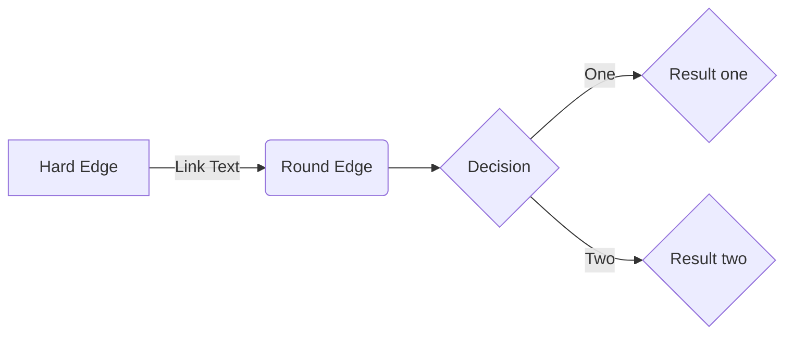
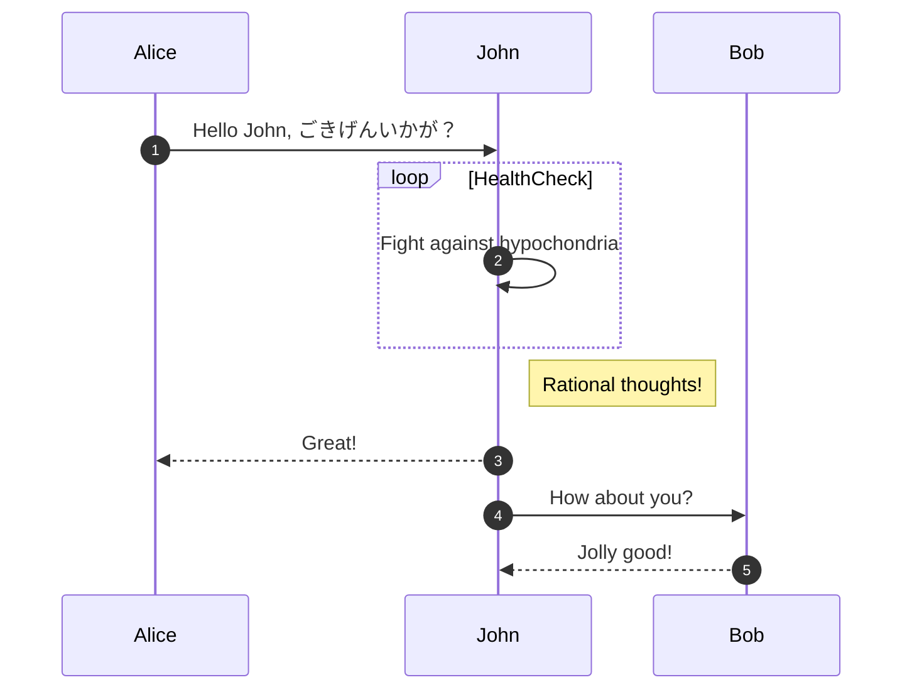
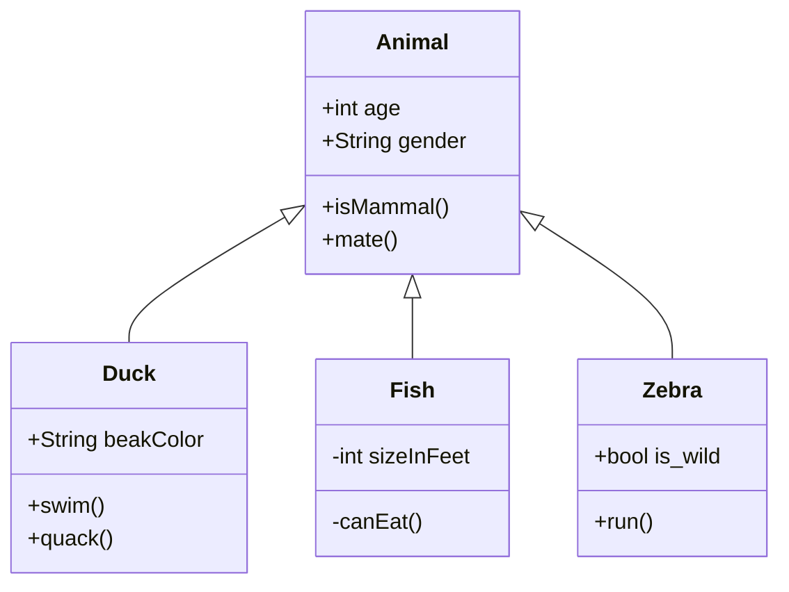
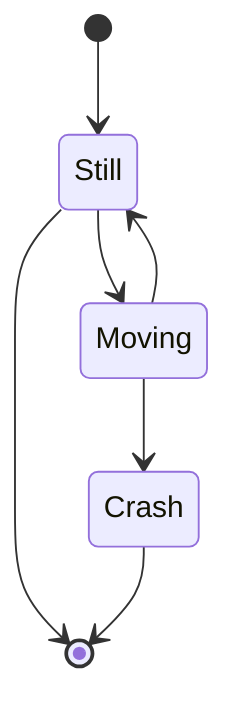
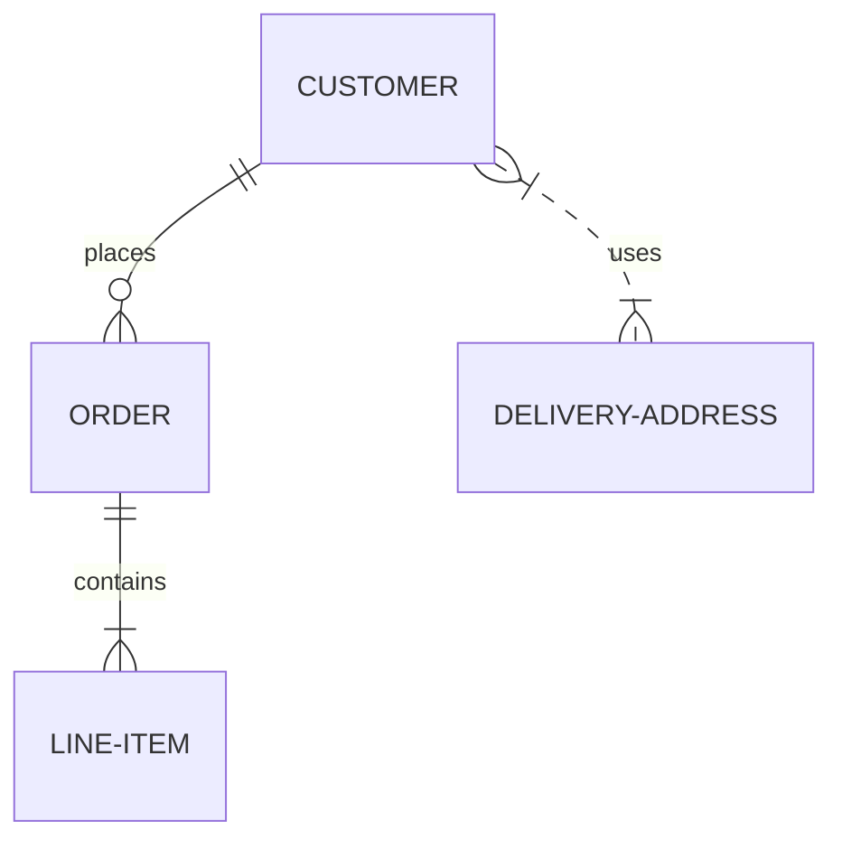
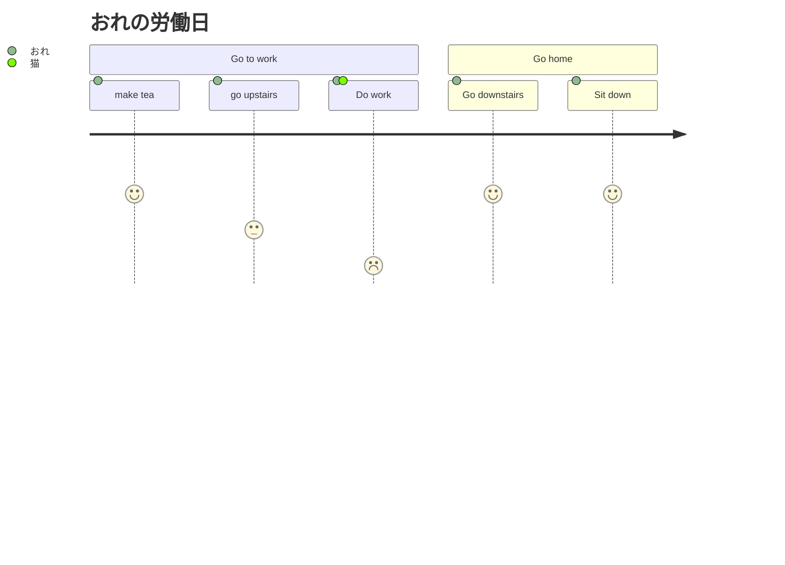
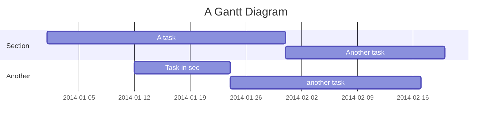
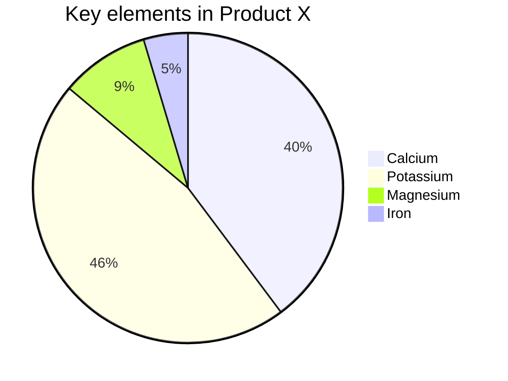
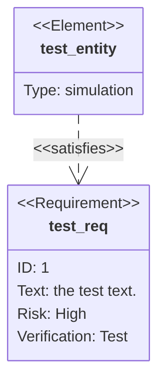

# 序

[公式ページ](https://mermaid-js.github.io/mermaid#/)
から例をひく。


# mermaid とは

# flowchart

以下がソースである

```
flowchart LR
 A[Hard Edge] --> |Link Text| B(Round Edge)
 B --> C{Decision}
 C --> |One| D{Result one}
 C --> |Two| E{Result two}
```

以下のようになる



# sequence diagram

```
sequenceDiagram
  autoNumber
  Alice ->> John: Hello John, ごきげんいかが？
  loop HealthCheck
    John ->> John: Fight against hypochondria
  end
  Note right of John: Rational thoughts!
  John -->> Alice: Great!
  John ->> Bob: How about you?
  Bob -->> John: Jolly good!
```



# class diagram

```
classDiagram
      Animal <|-- Duck
      Animal <|-- Fish
      Animal <|-- Zebra
      Animal : +int age
      Animal : +String gender
      Animal: +isMammal()
      Animal: +mate()
      class Duck{
          +String beakColor
          +swim()
          +quack()
      }
      class Fish{
          -int sizeInFeet
          -canEat()
      }
      class Zebra{
          +bool is_wild
          +run()
      }

```


# state diagram

状態遷移図


```
stateDiagram-v2
    [*] --> Still
    Still --> [*]

    Still --> Moving
    Moving --> Still
    Moving --> Crash
    Crash --> [*]

```



# ER

Entity Relationship Diagram

```
erDiagram
    CUSTOMER ||--o{ ORDER : places
    ORDER ||--|{ LINE-ITEM : contains
    CUSTOMER }|..|{ DELIVERY-ADDRESS : uses
```




# journey

ジャーニーマップ

User Journey

```
journey
    title My Working Day
    section Go to work
     make tea: 5: me
     go upstairs: 3: me
     Do work: 1 : me, cat
   section Go home
     Go downstairs: 5: me
     Sit down: 5: me
    
```



# ガントチャート

Gantt

```
gantt
    title A Gantt Diagram
    dateFormat  YYYY-MM-DD
    section Section
    A task           :a1, 2014-01-01, 30d
    Another task     :after a1  , 20d
    section Another
    Task in sec      :2014-01-12  , 12d
    another task      : 24d
```




# パイチャート

Pie

```
pie
    title Key elements in Product X
    "Calcium" : 42.96
    "Potassium" : 50.05
    "Magnesium" : 10.01
    "Iron" :  5

```





# 要件

requirement diagram




```
requirementDiagram

    requirement test_req {
    id: 1
    text: the test text.
    risk: high
    verifymethod: test
    }

    element test_entity {
    type: simulation
    }

    test_entity - satisfies -> test_req
```

# Git Graph (experimental)

```
gitGraph BT:
options
{
    "nodeSpacing": 120,
    "nodeRadius": 10
}
end
commit
branch newbranch
checkout newbranch
commit
commit
checkout master
merge newbranch
commit

```


# External Links

- [GitHubで使えるようになった Mermaid の便利なところ](https://zenn.dev/yasuhiroki/articles/dd0feae790ba41)
- [](https://mermaid-js.github.io/mermaid/#/)    
