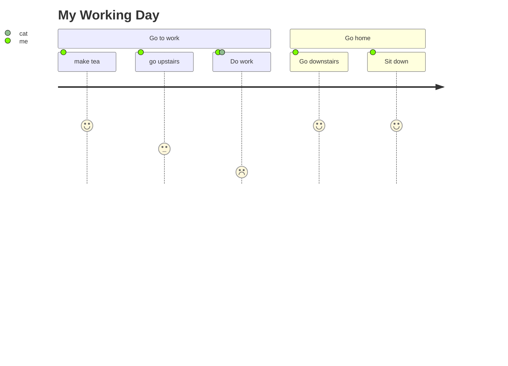
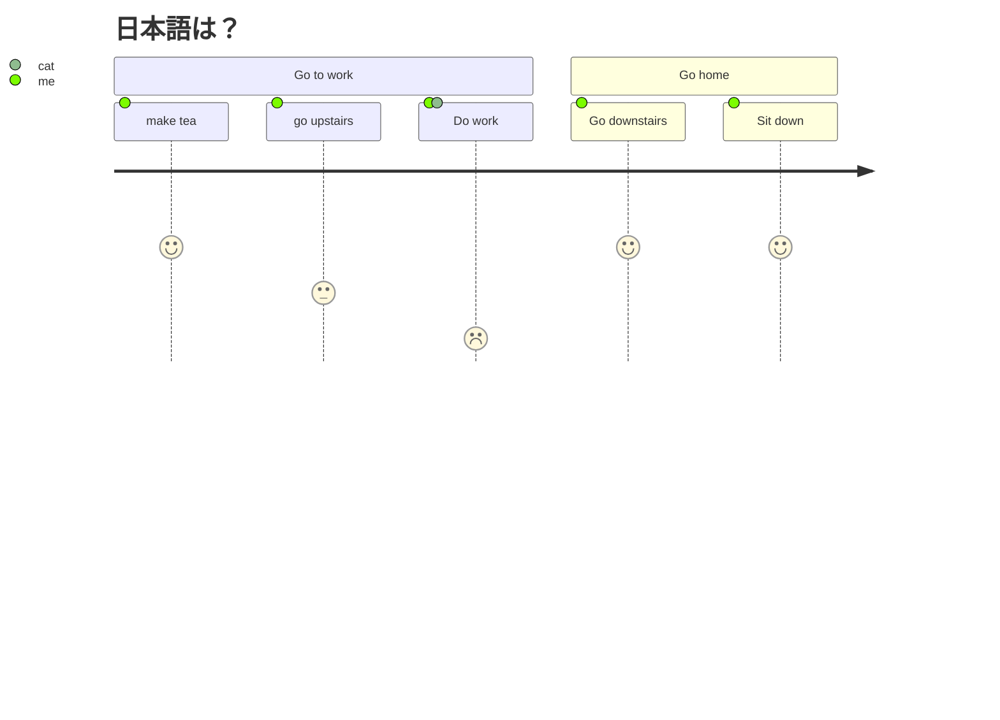

[ここ](https://cdn-ssl-devio-img.classmethod.jp/wp-content/uploads/2021/12/mermaid-markdown-in-notion_08_user-journey-diagram.png?_ga=2.63999727.1741402734.1646361101-277997237.1642648716)
から

```mermaid

journey
    title My Working Day
    section Go to work
     make tea: 5: me
     go upstairs: 3: me
     Do work: 1 : me, cat
   section Go home
     Go downstairs: 5: me
     Sit down: 5: me
    
```

```mermaid

journey
    title 日本語は？
    section Go to work
     make tea: 5: me
     go upstairs: 3: me
     Do work: 1 : me, cat
   section Go home
     Go downstairs: 5: me
     Sit down: 5: me
    
```
