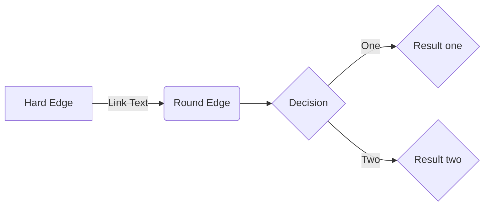
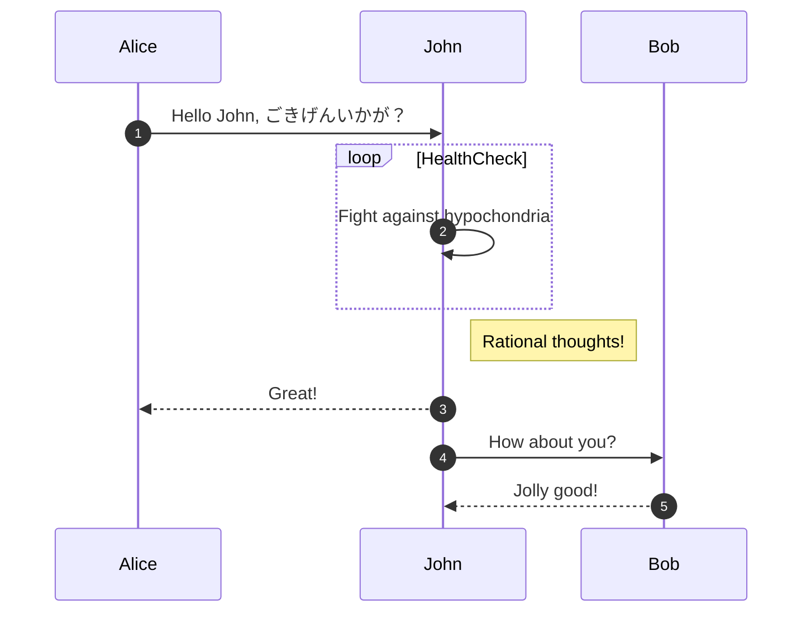
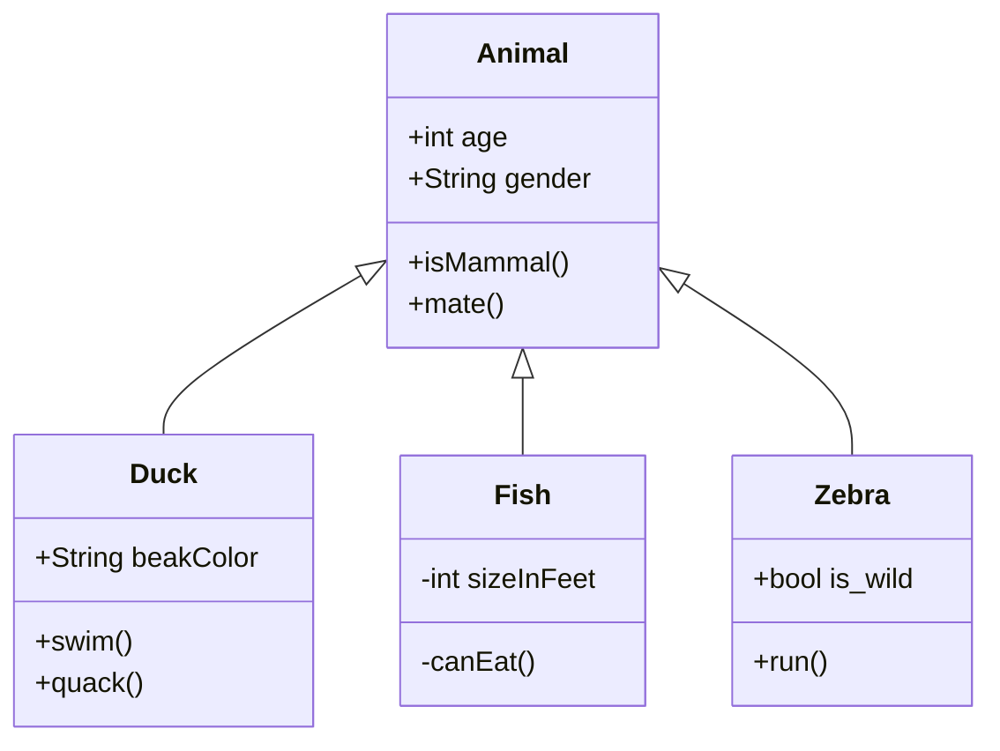
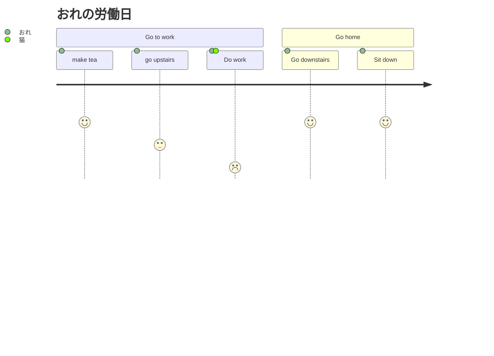

# 序

[ここ](https://cdn-ssl-devio-img.classmethod.jp/wp-content/uploads/2021/12/mermaid-markdown-in-notion_08_user-journey-diagram.png?_ga=2.63999727.1741402734.1646361101-277997237.1642648716)
から例をひく。


# mermaid とは

# flowchart

以下がソースである

```
flowchart LR
 A[Hard Edge] --> |Link Text| B(Round Edge)
 B --> C{Decision}
 C --> |One| D{Result one}
 C --> |Two| E{Result two}
```

以下のようになる



# sequence diagram



# class diagram



# journey

```

journey
    title My Working Day
    section Go to work
     make tea: 5: me
     go upstairs: 3: me
     Do work: 1 : me, cat
   section Go home
     Go downstairs: 5: me
     Sit down: 5: me
    
```
日本語を使うことも可能だ。


